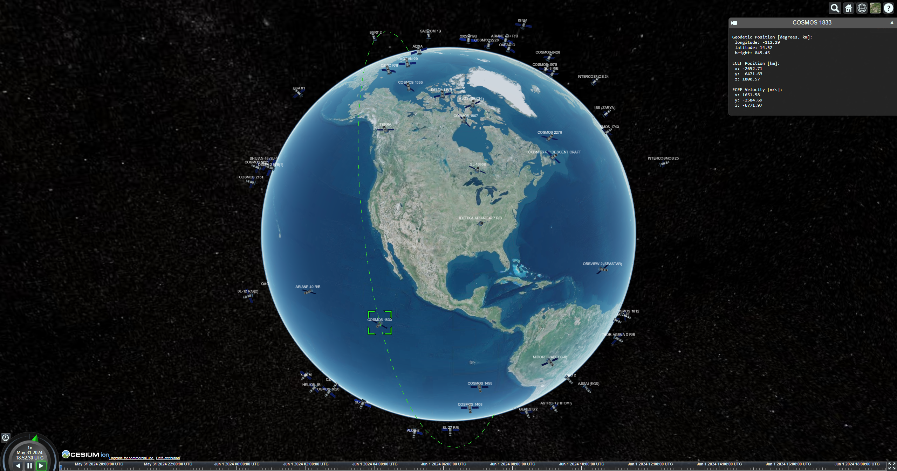

# CesiumJS Satellite Visualizer



This project shows how supplemental scene data, such as satellite positions, can be added to the CesiumJS scene. Satellites are expressed via [entity-config.json](config/entity-config.json) via a Two-Line Element Set and a reference to an asset defined in [glb-config.json](config/glb-config.json). For convenience, [generate-entity-config.sh](generate-entity-config.sh) has been provided as a means of quickly generated a valid `entity-config.json` with up-to-date TLE information provided by [CelesTrak](https://celestrak.org). This script can be updated to point to any other data provider of your choosing that matches the data schema.

## Setup
1. Create a free [Cesium Account](https://ion.cesium.com/signup/)

1. Go to [Cesium Ion](https://ion.cesium.com) and select `Access Tokens`

1. Create or reuse an existing access token with the following access:
    - assets:read
    - geocode

1. Copy the value under `Token`

1. Create a `.env` file in the root directory of this repository containing the following, where `<Token Value>` is replaced by the token copied in the previous step:
    ````
    CESIUM_TOKEN=<Token Value>
    ````

1. Execute [generate-entity-config.sh](generate-entity-config.sh) to update [entity-config.json](config/entity-config.json) with the most recent satellite TLE data. You should only need to do this at most once every 24 hours.

## Usage
1. Open this project in the provided devcontainer:
    ```
    F1-> DevContainers: Rebuild and Reopen in Container
    ```

1. Launch the application via `F5` or:
    ```
    Run and Debug -> Run Application
    ```

1. Once webpack has built and deployed the application, it can be accessed at:
    ```
    http://localhost:8080
    ```

## Attribution
- Satellite TLEs provided by [CelesTrak](https://celestrak.org)
- "Satellite - Low Poly" (https://skfb.ly/o6KyF) by calebcram is licensed under Creative Commons Attribution (http://creativecommons.org/licenses/by/4.0/).
